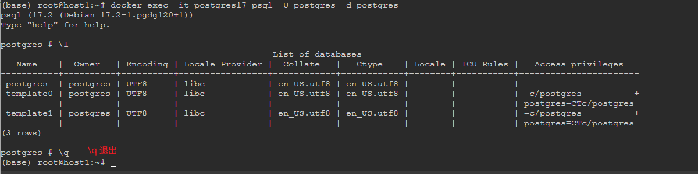

# 一、docker-compose安装pg17
## 1. 下载pg17镜像
```bash
docker pull postgres:17.2
docker images
```
## 2. 创建pg17工作目录
```bash
mkdir -p /app/pg17
mkdir -p /app/docker-data/postgresql && chmod 777 /app/docker-data/postgresql
```
## 3. 创建docker-compose.yml文件
```bash
cat > /app/pg17/docker-compose.yml << EOF
version: "3.9"
services:
  dev-postgres:
    image: postgres:17.2 
    container_name: postgres17
    # restart: always
    shm_size: 128mb # set shared memory limit
    environment:
      POSTGRES_USER: postgres
      POSTGRES_PASSWORD: postgres
      TZ: Asia/Shanghai
    ports:
      - 15432:5432
    volumes:
      - /app/docker-data/postgresql:/var/lib/postgresql/data
      - /etc/localtime:/etc/localtime:ro
EOF
```
## 4. 运行Docker Compose 启动容器
```bash
cd /app/pg17
docker-compose up -d
```
## 5. 查看容器状态
```bash
docker ps -a
# 查看日志
docker logs -f postgres17
```
## 6.连接到pg17数据库
```bash
docker exec -it postgres17 psql -U postgres -d postgres
# \l
# \q
```

## 7.白名单配置 (无法连接需要配置) 可选
```bash
cat > /app/docker-data/postgresql/pg_hba.conf << EOF
# TYPE  DATABASE   USER  ADDRESS      METHOD
local   all         all                trust
host    all         all  127.0.0.1/32  trust
host    all         all  0.0.0.0/0     md5
host    replication all  0.0.0.0/0     md5
local   replication all                trust
EOF
```
## 8.重启容器
```bash
docker restart postgres17
```
# 二、创建数据库、用户、授权
```postgresql
-- 创建用户 owuser
CREATE USER owuser WITH PASSWORD 'Pass@1234';

-- 创建数据库 db01
CREATE DATABASE db01 OWNER owuser;

-- 切换到 db01 数据库
\c db01 owuser;

-- 授权 owuser 用户对 db01 数据库的所有权限
GRANT ALL PRIVILEGES ON DATABASE db01 TO owuser;

-- 创建 schema owuser
CREATE SCHEMA owuser;

-- 授权 owuser 用户对 owuser schema 的所有权限
GRANT ALL ON SCHEMA owuser TO owuser;

```
## 创建表
```postgresql
-- 在 owuser schema 下创建表 tm_user
drop table if exists owuser.tm_user;
CREATE TABLE owuser.tm_user (
    id          SERIAL PRIMARY KEY,
    user_name   VARCHAR(255) NOT NULL,
    email       VARCHAR(255) NOT NULL,
    create_date TIMESTAMP    NOT NULL DEFAULT CURRENT_TIMESTAMP
);

-- 插入订单明细数据 tt_product_info
drop table if exists owuser.tt_product_info;
CREATE TABLE owuser.tt_product_info
(
    id             SERIAL PRIMARY KEY,
    product_name   VARCHAR(255)   NOT NULL,
    price_per_unit NUMERIC(10, 2) NOT NULL,
    product_descr  TEXT           NOT NULL,
    create_date    TIMESTAMP      NOT NULL DEFAULT CURRENT_TIMESTAMP
);

-- 在 owuser schema 下创建表 tt_order
drop table if exists owuser.tt_order;
CREATE TABLE owuser.tt_order (
    id           SERIAL PRIMARY KEY,
    customer_id  INT            NOT NULL,
    order_date   TIMESTAMP      NOT NULL DEFAULT CURRENT_TIMESTAMP,
    total_amount NUMERIC(10, 2) NOT NULL
);
-- 在 owuser schema 下创建表 tt_order_item
drop table if exists owuser.tt_order_item;
CREATE TABLE owuser.tt_order_item
(
    id          SERIAL PRIMARY KEY,
    order_id    INT            NOT NULL,
    product_id  INT            NOT NULL, -- 引用 product_info 表的 ID
    quantity    INT            NOT NULL,
    total_price NUMERIC(10, 2) NOT NULL, -- 计算后的总价
    order_descr TEXT,
    create_date TIMESTAMP      NOT NULL DEFAULT CURRENT_TIMESTAMP,
    FOREIGN KEY (order_id) REFERENCES owuser.tt_order (id),
    FOREIGN KEY (product_id) REFERENCES owuser.tt_product_info (id)
);

```
## 插入数据
客户端工具datagrip VM 选项: -Xmx2048m -Duser.timezone=Asia/Shanghai
```postgresql
-- 插入用户数据 tm_user
INSERT INTO owuser.tm_user (user_name, email, create_date)
VALUES ('张无忌', 'zhangwuji@example.com', CURRENT_TIMESTAMP),
       ('赵敏', 'zhaomin@example.com', CURRENT_TIMESTAMP),
       ('周芷若', 'zhouzhiruo@example.com', CURRENT_TIMESTAMP),
       ('杨逍', 'yangxiao@example.com', CURRENT_TIMESTAMP),
       ('范遥', 'fanyao@example.com', CURRENT_TIMESTAMP),
       ('灭绝师太', 'miejueshita@example.com', CURRENT_TIMESTAMP),
       ('金毛狮王', 'jinmaoshiwang@example.com', CURRENT_TIMESTAMP),
       ('青翼蝠王', 'qingyifuwang@example.com', CURRENT_TIMESTAMP),
       ('白眉鹰王', 'baimeiyingwang@example.com', CURRENT_TIMESTAMP),
       ('成昆', 'chengkun@example.com', CURRENT_TIMESTAMP);

-- 插入产品数据 product_info
INSERT INTO owuser.tt_product_info (product_name, price_per_unit, product_descr)
VALUES ('屠龙刀', 5000.00, '屠龙宝刀，武林至尊，号令天下，莫敢不从。'),
       ('倚天剑', 5000.00, '倚天剑，锋利无比，削铁如泥，是为剑中之神。'),
       ('乾坤大挪移', 3000.00, '乾坤大挪移，明教至高无上的武学心法，能移山填海，夺天地之造化。'),
       ('九阳真经', 3000.00, '九阳真经，武学至宝，练成后内力深厚，百毒不侵，是为武林中的无上秘笈。'),
       ('圣火令', 2000.00, '圣火令，明教圣物，见令如见教主，号令教众，莫敢不从。'),
       ('屠狮大会', 1000.00, '屠狮大会，是武林中的一大盛事，各路英雄为了争夺屠龙刀而聚集。'),
       ('武当剑法', 1500.00, '武当剑法，以柔克刚，剑走偏锋，是武当派的镇派之宝。'),
       ('峨眉九阳功', 1500.00, '峨眉九阳功，峨眉派的内功心法，源出九阳真经，威力无穷。'),
       ('少林七十二绝技', 2500.00, '少林七十二绝技，少林寺的武学精华，每一项都是武林中的绝学。'),
       ('崆峒派七伤拳', 1200.00, '七伤拳，崆峒派的独门武技，拳力刚猛，伤人伤己，非同小可。');   
    
    
-- 插入订单数据 tt_order
INSERT INTO owuser.tt_order (customer_id, order_date, total_amount)
SELECT
    ((i-1) % 10) + 1 AS customer_id, -- 循环 1 到 10 的 customer_id
    CURRENT_TIMESTAMP - (RANDOM() * 365 * INTERVAL '1 day') AS order_date, -- 随机生成过去一年内的日期
    ROUND((RANDOM() * 10000)::NUMERIC, 2) AS total_amount -- 随机生成 0 到 9999 的总金额
FROM
    generate_series(1, 100) AS s(i); -- 生成 1 到 100 的序列

-- 插入 订单明细数据 tt_order_item
WITH product_order AS (
    SELECT
        o.id AS order_id,
        p.id AS product_id,
        p.price_per_unit,
        p.product_descr
    FROM
        owuser.tt_order o
            CROSS JOIN owuser.tt_product_info p
)
INSERT INTO owuser.tt_order_item (order_id, product_id, quantity, total_price, order_descr)
SELECT
    order_id,
    product_id,
    FLOOR(RANDOM() * 5) + 1 AS quantity, -- 随机生成 1 到 5 的数量
    (FLOOR(RANDOM() * 5) + 1) * price_per_unit AS total_price, -- 计算总价
    product_descr AS order_descr -- 使用商品描述作为订单描述
FROM
    product_order;
-- 更新 tt_order_item 的 total_price
UPDATE owuser.tt_order_item
SET total_price = quantity * price_per_unit
FROM owuser.tt_product_info
WHERE owuser.tt_order_item.product_id = owuser.tt_product_info.id;
```
##  清空表并重新设置序列
```postgresql
-- 清空 tt_order 表并重新设置序列
SELECT pg_get_serial_sequence('tt_order', 'id');
ALTER SEQUENCE owuser.tt_order_id_seq RESTART WITH 1;
TRUNCATE TABLE tt_order CASCADE;
```
## 查询
```postgresql
-- 统计每个用户的总商品数量和总金额, 按金额降序排序
SELECT
    u.id AS user_id,
    u.user_name AS user_name,
    COALESCE(SUM(oi.quantity), 0) AS total_quantity,
    COALESCE(SUM(oi.quantity * pi.price_per_unit), 0) AS total_amount
FROM
    owuser.tm_user u
LEFT JOIN owuser.tt_order o ON u.id = o.customer_id
LEFT JOIN owuser.tt_order_item oi ON o.id = oi.order_id
LEFT JOIN owuser.tt_product_info pi ON oi.product_id = pi.id
GROUP BY
    u.id, u.user_name
order by total_amount desc;
```


