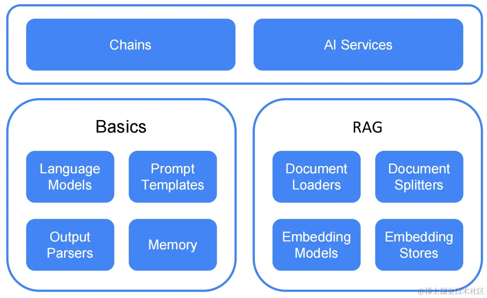

# 项目背景
  构建一个基于 `Spring Boot 3.4.0` 的后端应用，集成 SQL 解析、转换和优化功能，并结合大语言模型（如 `Ollama` 和 `Qwen2.5`）来提高返回质量。
  我们将一步一步分析并完成您的需求,且完成一个功能附上对应的测试代码。

# 1. 项目需求分析
## 功能需求：
- SQL解析：解析用户输入的 SQL（`Oracle` 或 `MySQL`），提取其中的 SQL 语句。
- SQL转换：将 `Oracle` 或 `MySQL` 的 SQL 转换成 `PostgreSQL` 语句。
  SQL优化：提供 SQL 执行计划、预计耗时和优化建议。
- 模型集成：集成大语言模型（`Ollama` 和 `Qwen2.5`）进行AI模型来优化SQL语句。
- Prompt优化：使用`LangChain` 来优化 prompt，增强回复的准确性和安全性，拒绝无关或敏感问题。
- Function Calling：使用 `Function Calling` 来处理日期等特殊关键字，提高模型返回质量。
- 本地化部署：项目不支持联网，所以不依赖外部搜索服务。
## 大语言模型调用
- **目标**: 调用大模型 API 对 SQL 进行优化、生成执行计划、提供优化建议。
- **多层纠错与筛选机制**： 生成SQL只是第一步，确保生成结果的准确性同样重要。 
- 模型采用三阶段纠错与筛选流程：
  - 多层纠错与筛选机制: 对初始生成的SQL进行语法和逻辑错误修复。 
  - 候选筛选：通过深度优化的筛选模型，精确挑选最优SQL。
  - 综合优化：将逻辑一致性作为最终判断标准，替代传统的“自一致性策略”。

## 技术栈：
- ：用于提供 RESTful API。
- ：用于 SQL 方言转换（Oracle/MySQL 到 PostgreSQL）。
- ：与大语言模型交互。
- ：用于优化 prompt 提高模型的响应质量。
- ：本地部署的开源 LLM 服务框架，支持多种开源模型。
  - 支持模型：`Llama2`、`Mistral`、`Gemma` 等
  - 特点：轻量级部署，API 简单，资源占用低
- ：通义千问2.5，阿里云开源的大语言模型，支持中英双语及多种任务。
  - 参数规模：支持 `0.5B`、`1.8B`、`4B`、`7B`、`14B`、`72B` 等多种规格
  - 特点：支持 32K 上下文，具备代码理解和生成能力

# 2. 项目结构设计
## 主要模块：
- API层：用于接收用户请求并返回处理后的结果。
- 服务层：负责 SQL 解析、转换、优化以及与大模型接口交互。
- 模型集成层：与 `Ollama` 和 `Qwen2.5` 交互，并使用 `LangChain` 优化 prompt。
- 配置层：配置虚拟线程、SQL解析工具和模型接口。

# 3.部署
## 安装git
```bash
# 安装git
# 第一次使用：         
centos：
yum install git       

Ubuntu：
apt-get install git

# 克隆项目
git clone https://github.com/mlxiong518/SQLBrigerAI.git

# 更新本地代码 
git pull

# 查看代码状态 
git status

# 后面提交代码
git pull //拉取最新的代码文件
git add .     
git commit -m "first commit" //第一次提交  
git pull //！！！ 提交之前，先同步下最新版的代码，避免冲突
git push -u origin master //同步到远程服务器
```

## 3.1 容器化部署
  项目使用 `Docker` 进行容器化部署，确保项目的可移植性和可重复性。
```bash
# 使用 OpenJDK 21 基础镜像
FROM openjdk:21-jdk-slim

# 设置工作目录
WORKDIR /app

# 将构建好的 JAR 文件复制到容器中
COPY target/*.jar /app/app.jar

# 暴露应用端口
EXPOSE 8080

# 运行应用程序
ENTRYPOINT ["java", "-jar", "/app/app.jar"]
```
## 3.2 构建 Docker 镜像
在项目的根目录下，执行以下命令来构建 Docker 镜像：
```bash
docker build -t SQLBrigerAI:0.0.1 .
```

## 3.3 运行 Docker 容器
使用以下命令运行生成的 Docker 镜像：
```bash
docker run -p 8080:8080 SQLBrigerAI:0.0.1
```
这将启动一个容器，并将应用程序暴露在宿主机的8080端口。

```java
mvn clean package
java -jar SQLBrigerAI.jar --spring.profiles.active=dev
```